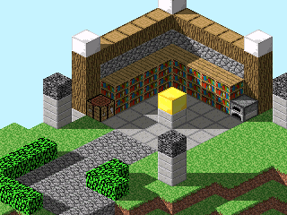

# Blocks for the TI 84 CE

A Minecraft-esque game for the TI 84 CE calculator. In it you can generate natural-looking worlds, place up to 24 different kinds of blocks, keep up to 5 saves, and enjoy real-time shadow effects, transparent water, and a 10 FPS framerate!

 ## Check out [this video](https://www.youtube.com/watch?v=Bj9CiMO66xk) to see it running on real hardware, and for more implementation details.

Some sample gameplay captured in [CEmu](https://ce-programming.github.io/CEmu/). Note that the triangular screen-tearing
is an artifact of the emulator, and doesn't show up when running on real hardware.

## Try It Yourself

**Note:** Due to reliance on some eZ80 hardware instructions, this program can only be run on CE or later model calculators from the Ti84 family.

1. Download the binary [here](bin/BLOCKS.8xp).
2. Download the [CE C Standard Libraries](https://github.com/CE-Programming/libraries/releases/tag/v11.2).
3. Load both onto your calculator using the [TI Connect™ CE software](https://education.ti.com/en/products/computer-software/ti-connect-ce-sw).
4. Run the ASM program either with `Asm(prgmBLOCKS)` or your favorite graphical shell.
5. The world select menu should appear. Select an empty save slot and press enter to generate a new world.

**Warning:** This program takes up a lot of RAM on the calculator, and doesn't always do so gracefully. It doesn't happen very often, but in the case where you get it to crash **you will need to reset your calculator**, which will clear any unarchived data in RAM. It's best to just archive anything you wouldn't want to lose before running this. Not only does it protect that data from crashes, but it frees up more memory for the game.

## Controls

Navigating a 3D world is tricky, but I've tried my best to make the controls manageable. To control this program, use the following:

- Move the cursor with the outer numpad (`1` - `9` except for `5`) to move in that direction (i.e. 6 to move to the right)
- Move straight up and straight down (in 3D) with `*` and `-` respectively
- Scroll the view with the arrow keys (it will return to the player automatically if it gets too far away)
- Place or remove blocks at the current cursor position with `5`
- Open the block select screen with `enter`
- Save and quit to the world select menu with `2nd`

## Sharing Worlds

Due to technical limitations the world format is a bit strange. Each world is composed of 17 files on your calculator, for example in the case of "World A" the files will be

- WORLDA
- WORLDA00 - WORLDA15

If you want to transfer a world onto or off of your calculator, make sure you share all of these files.

---

*NOT AN OFFICIAL MINECRAFT PRODUCT. NOT APPROVED BY OR ASSOCIATED WITH MOJANG OR MICROSOFT.* 
